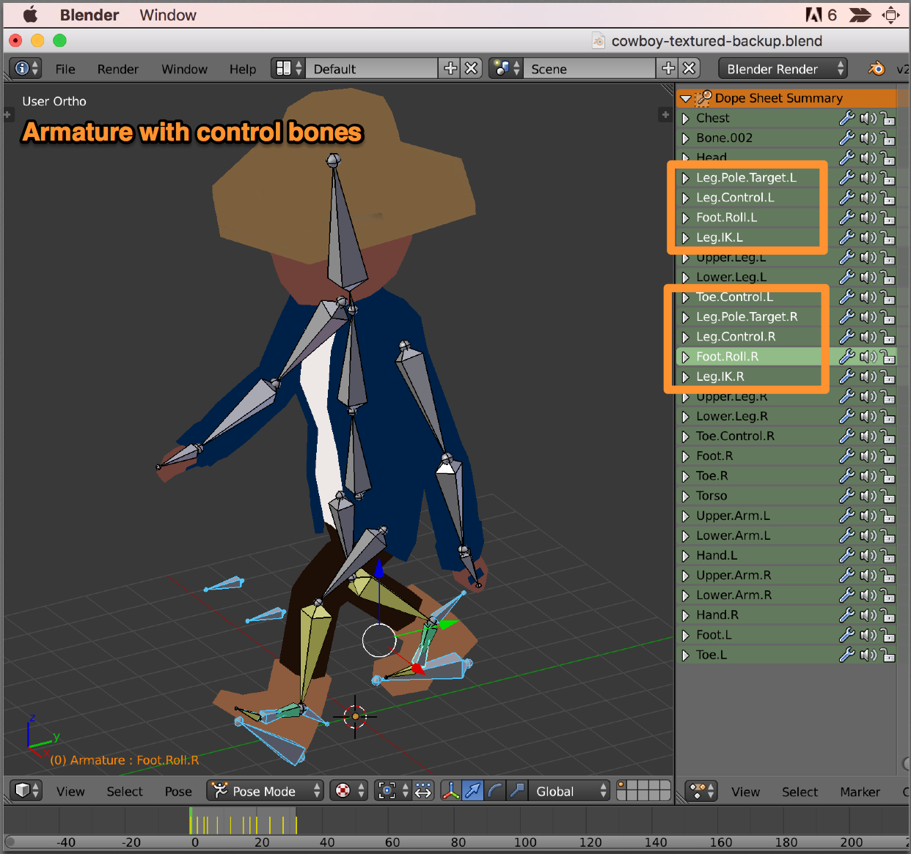
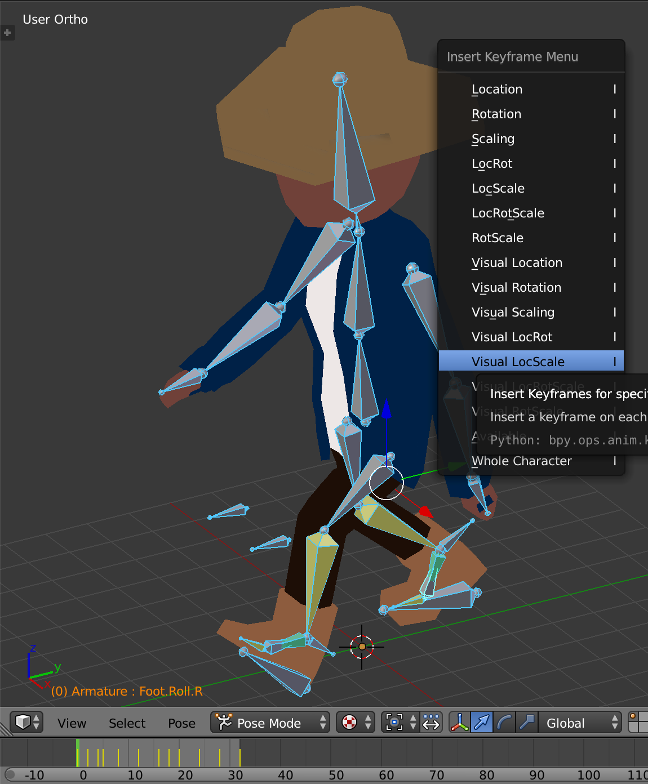
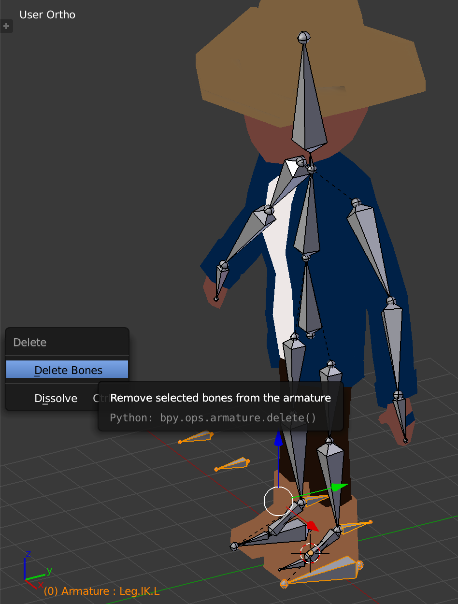

## How to Export

### Step 1 - Select your Mesh

Select your mesh in `Object mode` but *DO NOT* select your skeleton (armature).

### Step 2 - Export your Mesh

`File -> Export -> Collada`

### Step 3 - Choose your export settings

lorem ipsum

## Multiple Meshes

`collada-dae-parser` does not support files with multiple meshes. You should join your geometries in `Object mode` before exporting.

*First select all of your meshes while in Object mode*

*Then join them using `Ctrl` + `J`*

## Control Joints

`collada-dae-parser` does not support control bones such as pole targets, inverse kinematic bones or control bones.

If you're rig uses control bones, you'll need to apply their effects onto your deformation joints before exporting your mesh.

#### 1. Start from a copy file

Begin by saving and working from a new copy of your model, since you'll be modifying your keyframes and rig before exporting.

#### 2. Visual keyframes

Go through all of your animation's keyframes, select all bones and insert a visual location rotation keyframe.

This adds a keyframe to each joint that positions it exactly how you see it. Effectively baking the effects of
your control bones into your deformation bones.

#### 3. Delete control bones

Once you've added your visual keyframes you can delete all of your control bones and verify that your
animation still works. If so, you can export your collada file as usual.

## Skeletons with only Rigid Motions

TODO ... explain this

lorem ipsum...

Make sure to apply scale

lorem ipsum

`CTRL` + `A` while in `Object mode` in Blender. Then `Apply the Scale`

This changes your model to be scaled at `[1.0, 1.0, 1.0]` meaning that your exported joint matrices will be rigid transforms

lorem ipsum

